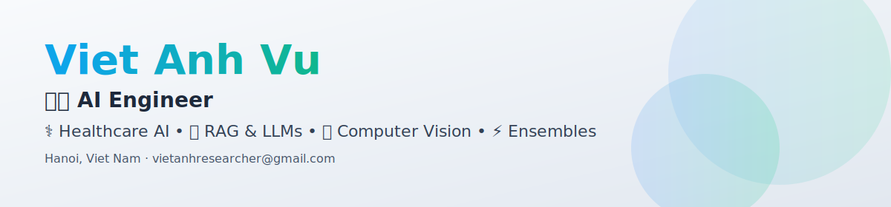

<!-- Banner: tự đổi dark/light -->
<picture>
  <source media="(prefers-color-scheme: dark)" srcset="assets/banner-dark.svg">
  
</picture>

<h1 align="center">Viet Anh Vu</h1>

  <b>AI Engineer</b> — Healthcare AI • EdTech AI • LLMs & RAG • Computer Vision • MLOps

  
  
  

---

## About me

- MSc in Computer Science @ **HUST** (Jun 2025 – Present) | BSc (Honours), GPA 3.48/4.0
- AI Engineer @ **Prep Education** — Automated Essay Scoring & Grammar Correction for IELTS
- Previously: AI Engineer @ **Vietsens Technology Group** — Healthcare AI integrated with National Hospital Management Software (Bach Mai Hospital)
- Research: Ensemble Learning, Computer Vision — 2 manuscripts under review
- Publication: **VISTA** — IEEE SCCI 2024

---

## Experience

### Prep Education — AI Engineer (Oct 2025 – Present)

<b>Automated Essay Scoring (AES)</b> — IELTS Writing & Speaking

- **Speaking**: ML + APA (pronunciation) + GEC (grammar) + Dify (vocabulary). Accuracy ±0.5 ~82%, QWK & PCC ~90%
- **Writing**: Cross-prompt DeBERTa-V3 (189M params), quantized T5 (120M params). Accuracy ±0.5 ~85–87%, ±1 ~98%
- End-to-end MLOps: Docker → GitLab CI/CD → ArgoCD → Kubernetes
- Dynamic batching & request queuing for thousands of concurrent assessments

<b>English Lexical Grammar (ELG) Correction</b> — Rule-based + LLMs

- Hybrid grammar correction: rule-based pattern matching + LLM inference
- Covers grammatical errors, vocabulary misuse, spelling, collocations, idiomatic expressions, linking devices
- F0.5 ~60% on private test sets
- Production: Docker + GitLab CI/CD + ArgoCD on Kubernetes, request batching & caching

### Vietsens Technology Group — AI Engineer (Sep 2024 – Sep 2025)

<b>AI Healthcare Assistant</b> — LLMs, NLP, HIS integration

- AI agents for medical history inquiry & initial diagnosis, integrated with National Hospital Management Software (Bach Mai Hospital)
- Modules for patient data analysis, case management, and diagnostic support

<b>Prescription Recommendation & Conflict Detection</b>

- Predictive system for medication prescribing based on patient records
- LLMs for duplicate active ingredient detection & drug-drug interaction identification

### FPT Information System — AI Engineer Intern (Aug 2023 – May 2024)

<b>OCR for Financial Reports</b> — PaddleOCR, TrOCR, LayoutLMv3

- End-to-end OCR pipeline: preprocessing → text detection → layout understanding → NER + regex normalization
- Table & key-value extraction from bank financial reports

---

## Research & Publication

- **VISTA** (IEEE SCCI 2024) — Variable-Length GA + LSTM Surrogate for Ensemble Selection in MLES
  Kate Han, Truong Thanh Nguyen, **Viet Anh Vu**, Alan W.-C. Liew & Tien Thanh Nguyen
- **Application of Deep Learning Network in Underwater Image Recognition and Segmentation** — ResNet denoising + UNet_v2 / V_UNet *(manuscript under review)*
- **Enhancing Facial Expression Recognition with Lightweight Attention-Based CNN** — MobileNetV2 + Patch Extraction + Attention for edge devices *(manuscript under review)*

---

## Skills & Tools

**ML/DL**: LLMs, RAG, Computer Vision, NLP, Ensemble Learning, Genetic Algorithms
**MLOps**: Docker, Kubernetes, GitLab CI/CD, ArgoCD, Dynamic Batching, Model Serving
**OCR**: PaddleOCR, Tesseract, TrOCR, LayoutLM/v3

---

## Education & Achievements

- **MSc, Computer Science** — HUST (Jun 2025 – Present)
- **BSc (Honours), Computer Science** — HUST (Oct 2020 – Jul 2024) — GPA 3.48/4.0
- **WiDS Datathon 2023** — 2nd Prize (Extreme Weather Forecasting)

---

## Contact

- Email: **mrvietanh2@gmail.com**
- CV: [`resume.pdf`](data/resume.pdf)

---

## GitHub at a glance

<table>
  <tr>
    <td width="50%">
      
    </td>
    <td width="50%">
      
    </td>
  </tr>
  <tr>
    <td width="50%">
      
    </td>
    <td width="50%">
      
    </td>
  </tr>
</table>

---

  

